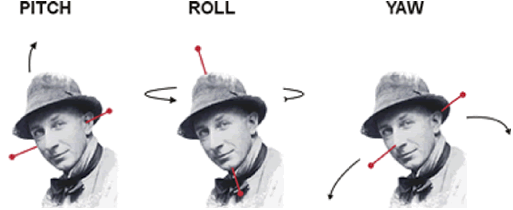
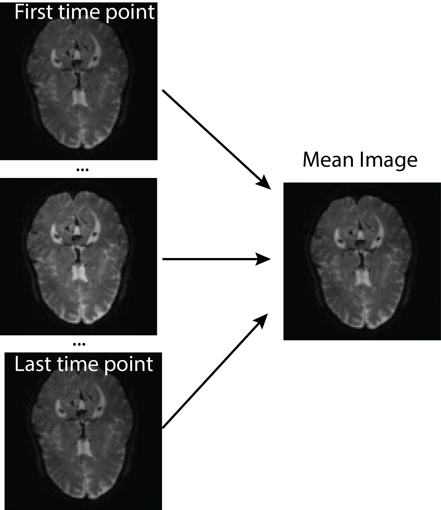
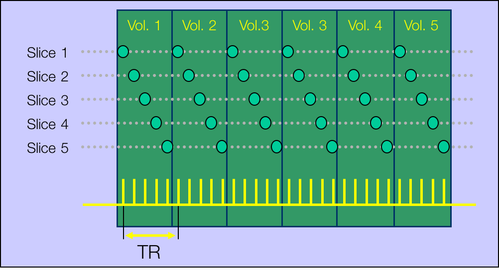
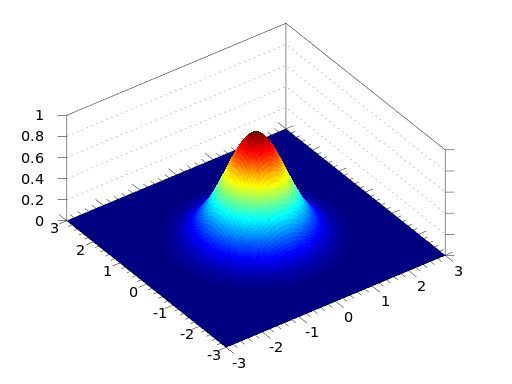

<style type="text/css">
article {
  font-size: 30pt;
}
</style>


```{r setup, include=FALSE, message = FALSE}
knitr::opts_chunk$set(echo = FALSE, prompt = FALSE, message = FALSE, warning = FALSE, comment = "", results = 'hide')
library(pander)
library(rvest)
library(httr)
library(neurobase)
library(matlabr)
library(spm12r)
library(tidyr)
library(ggplot2)
t1_fname = "anat.nii.gz"
```


## SPM

All of this is using the Statistical Parametric Mapping (SPM) [@penny2011statistical] software version 12:

- requies MATLAB (for this tutorial)
- All called through [`spm12r` package](https://github.com/muschellij2/spm12r)
- All code is found at https://github.com/muschellij2/talks/tree/master/fmri_task_processing


# `spm12r` Worked Example<br><br>Disclaimer: there is no universal fMRI pipeline<br> and many options are **specific** to this data analysis


## Data required for analysis

- One anatomical T1-weighted scan: `anat.nii.gz`
- One 4D fMRI task-related scan: `fmri.nii.gz`.  
- Information on design:
    - onsets/duration of stimuli
- Order of slices (which was first slice) 
    - or time slice measured (in ms).
- Repetition time (TR) from DICOM header/scanner/tech.

## Worked example: DICOM conversion

- DICOM to NIfTI: Convert the data using `dcm2niix` (https://github.com/rordenlab/dcm2niix).
- `dcm2niir`: https://github.com/muschellij2/dcm2niir
- `divest`: https://github.com/jonclayden/divest

```{r, eval = FALSE}
divest_result = divest::readDicom(path = "/path/to/DICOMs")
dcm2niir_result = dcm2niir::dcm2nii(basedir = "/path/to/DICOMs")
```

## Download the data 

https://figshare.com/articles/SFO-example/5442298

```{r makefiles, echo = TRUE, eval = FALSE}
url = paste0("https://ndownloader.figshare.com/articles/",
             "5442298/versions/1")
# download a temporary zip file
zipfile = tempfile(fileext = ".zip")
res = httr::GET(url, write_disk(path = zipfile))

####### unzip file code (not shown) ###########

out_files = c("anat.nii.gz", "fmri.nii.gz")
```


```{r makefiles_run, echo = FALSE, cache = TRUE, eval = TRUE}
library(httr)
out_files = c("anat.nii.gz", "fmri.nii.gz")
if (!all(file.exists(out_files))) {
  url = paste0(
    "https://ndownloader.figshare.com/articles/",
    "5442298/versions/1")
  zipfile = tempfile(fileext = ".zip")
  res = GET(url, 
            write_disk(path = zipfile),
            if (interactive()) progress())
  run_dir = "."
  if (!dir.exists(run_dir)) {
    dir.create(run_dir)
  }
  out_files = utils::unzip(zipfile, exdir = run_dir)
  names(out_files) = neurobase::nii.stub(out_files, bn = TRUE)
  file.remove(zipfile)
}
```

## fMRI information

```{r, eval = TRUE, echo = TRUE, results='markup'}
fmri_filename = "fmri.nii.gz"
tr = 1.8 # seconds
hdr = neurobase::check_nifti_header(fmri_filename) # nifti header
(nslices = oro.nifti::nsli(hdr))
(n_time_points = oro.nifti::ntim(hdr))
hdr
```


# Explore the Raw Data: <br><br>http://bit.ly/neuroshiny

## Explore the Data

The first part of any preprocessing pipeline should be to use exploratory techniques to investigate  detect possible problems and artifacts.

fMRI data often contain transient spike artifacts and slow drift.

An exploratory technique such as principal components analysis (PCA) can be used.

(courtesy of Martin Lindquist)


## Types of Registration
<div style="font-size: 20pt;">

- Rigid-body registration (linear) - 6 degrees of freedom (dof)


<div style="font-size: 8pt">
Image taken from [http://cnl.web.arizona.edu/imageprops.htm](http://cnl.web.arizona.edu/imageprops.htm)
</div>

- Pitch - Think of nodding ("yes")
- Yaw - Think of shaking head ("no") 
- Roll - Think of shoulder shrugging ("I don't know")
- x – left/right, y – forward/backward, z – jump up/down 

</div>

## Rigid Registration: The Math

<div style="font-size: 20pt;">

For a voxel $v$, the rigid transformation can be written as:

$$T_{\rm rigid}(v) = Rv + t$$
where $R =$
\small
$$\left[\begin{array}{ccc} \cos\beta\cos\gamma& \cos\alpha\sin\gamma + \sin\alpha\sin\beta\cos\gamma & \sin\alpha\sin\gamma - \cos\alpha\sin\beta\cos\gamma \\
-\cos\beta\sin\gamma & \cos\alpha\cos\gamma - \sin\alpha\sin\beta\sin\gamma & \sin\alpha\cos\gamma + \cos\alpha\sin\beta\sin\gamma \\
\sin\beta & -\sin\alpha\cos\beta & \cos\alpha\cos\beta \end{array}\right]$$
\normalsize

- 6 degrees of freedom
- $3$ associated with the translation vector: $t=(t_x, t_y, t_z)$
- $3$ associated with the rotation parameters: $\theta=(\alpha, \beta,\gamma)$. 

</div>


## Image Realignment: within-fMRI registration

<center>
 
</center>

## Image Realignment 


```{r realign, eval = FALSE, echo = TRUE}
realigned = spm12_realign(filename = fmri_filename,
  time_points = seq(n_time_points),
  quality = 0.98, separation = 3,
  register_to = "mean", est_interp = "bspline4", reslice_interp = "bspline4")
# reading in the mean image
mean_img = realigned[["mean"]]
mean_nifti = readnii(mean_img)
realigned$outfiles
```
```{r, eval = TRUE, results='markup'}
print("rfmri.nii")
```
```{r, eval = FALSE, echo = TRUE}
realigned$mat
```
```{r, eval = TRUE, results='markup'}
print("fmri.mat")
```


```{r realign_run, eval = TRUE, results='markup'}
# reading in the mean image
mean_img = "meanfmri.nii.gz"
mean_nifti = readnii(mean_img)
rpfile = "rp_fmri.txt"
rp = read.table(file = rpfile, header = FALSE)
```


## Image Realignment 

<center>
 
</center>

## Plotting the realignment parameters

```{r rp_file, eval = FALSE, echo = FALSE}
rp = read.table(file = realigned$rp, header = FALSE)
colnames(rp) = c("x", "y", "z", "roll", "pitch", "yaw")
head(rp, 2)
```

```{r rp_plot, echo = FALSE, fig.height=5, fig.width=10, fig.align="center"}
transparent_legend =  theme(
  legend.background = element_rect(fill = "transparent"),
  legend.key = element_rect(fill = "transparent", 
                            color = "transparent")
)
rp = read.table(file = rpfile, header = FALSE)
ord = c("x", "y", "z", "roll", "pitch", "yaw")
colnames(rp) = ord
head(rp, 2)
# get to degrees * 180/pi
# multiply by 50 for radius of head
rp[, c("roll", "pitch", "yaw")] = rp[, c("roll", "pitch", "yaw")]  * 50
rp$t = seq(nrow(rp))
long = gather(data = rp, key = Direction, value = value, -t)
long$Direction = factor(long$Direction, levels = ord)
ggplot(aes(x = t, y = value, colour = Direction), data = long) + 
  geom_line() + ylab("Movement (mm)") + xlab("Scan Number") + 
  transparent_legend + theme(legend.position = c(0.5, 0.75)) +
  ylim(-2, 2) + theme(legend.direction = "horizontal", 
                      legend.box = "horizontal") + 
  guides(colour = guide_legend(nrow = 1)) +
  theme(text = element_text(size = 20))
```

## Slice timing correction - temporal alignment

<center>
 
</center>

<div style="font-size: 20pt;">
(courtesy of Martin Lindquist)
</div>


## Slice timing correction - temporal alignment

- slice order: descending, dual-coil (different for ascending or interleaved)
- Need to know this from DICOM/design
```{r, echo = TRUE}
slice_order = c(1740, 1680, 1620, 1560, 1500, 1440, 1380, 
  1320, 1260, 1200, 1140, 1080, 1020, 960, 900, 840, 780, 
  720, 660, 600, 540, 480, 420, 360, 300, 240, 180, 120, 60, 
  0, 1740, 1680, 1620, 1560, 1500, 1440, 1380, 1320, 1260, 
  1200, 1140, 1080, 1020, 960, 900, 840, 780, 720, 660, 600, 
  540, 480, 420, 360, 300, 240, 180, 120, 60, 0)
ref_slice = 900
ta = 0 # since slice_order in ms
```


## What does this order mean?<br> 


## Data needed for slice timing correction

- Repetition time (from `hdr`)
- Number of time points and slices (from `hdr`)
- Slice order + need the reference slice (`ref_slice`), 
- Time between the first and the last slice within one scan (`ta`).  `ta = 0` if you give slice order in seconds/milliseconds.

```{r, echo = TRUE, echo = FALSE}
########################
# first slice is the bottom
########################
times = slice_order/1000
# need 60 - because how image works and it's ascending. 60 is bottom
df = data.frame(time = times, slice = 60 - seq(times))
df = dplyr::arrange(df, time)
# plot(x = df$time, y = df$slice, pch = 19, type = "n", xlim = c(0, 1.8))
# segments(x0 = df$time, y0 = df$slice, x1 = df$time + 0.25)

x = nifti(mean_nifti)
x = cal_img(x)
x@.Data <- aperm(x, c(2, 3, 1))
col = gray(0:64/64)
zlim <- c(x@cal_min, x@cal_max)
breaks <- c(zlim[1], 
            seq(min(zlim, na.rm = TRUE), 
                max(zlim, 
                    na.rm = TRUE), 
                length = length(col) - 1), zlim[2])
dims = dim(x)
X <- nrow(x)
Y <- ncol(x)
z = 48
splits = split(df, df$time)
ref_df = splits[[as.character(ref_slice/1000)]]
oldpar <- par(no.readonly = TRUE)

fname = "slice_timing.gif"
if (!file.exists(fname)) {
  animation::saveGIF({
    par(mfrow = c(1,1), mar = rep(0, 4), 
        bg = "black")  
    for (i in seq_along(splits)) {
      idf = splits[[i]]
      time_slice = unique(idf$time)
      graphics::image(1:X, 1:Y, x[, , z], col = col, 
                      breaks = breaks, bg = "black")
      abline(h = idf$slice, col = "red", lwd = 5)
      abline(h = ref_df$slice, col = "blue", lwd = 5)
      text(x = 14, y = 50, 
           labels = paste0("Time = ", time_slice, "s"), 
           cex = 1.2, col = "white")
    }
  }, movie.name = "fname", interval = 1.8/length(splits))
}

fname = "slice_timing_slow.gif"
if (!file.exists(fname)) {
  animation::saveGIF({
    par(mfrow = c(1,1), mar = rep(0, 4), 
        bg = "black")  
    for (i in seq_along(splits)) {
      idf = splits[[i]]
      time_slice = unique(idf$time)
      graphics::image(1:X, 1:Y, x[, , z], col = col, 
                      breaks = breaks, bg = "black")
      abline(h = idf$slice, col = "red", lwd = 5)
      abline(h = ref_df$slice, col = "blue", lwd = 5)
      text(x = 14, y = 50, 
           labels = paste0("Time = ", time_slice, "s"), 
           cex = 1.2, col = "white")
    }
  }, movie.name = fname, 
  interval = 1.8/length(splits) * 2)
}
par(oldpar)
```


## Slice timing correction - temporal alignment

```{r slice_time, eval = FALSE, echo = TRUE}
aimg = spm12_slice_timing(filename = realigned$outfiles,
  nslices = nslices,  
  tr = tr, slice_order = slice_order,
  time_points = seq(n_time_points),
  ta = ta, # since slice order given in ms 
  ref_slice = ref_slice, 
  prefix = "a")
print(aimg$outfile)
```

```{r}
aimg = "arfmri.nii"
print(aimg)
```


## After lice timing correction

<center>
 
</center>

<div style="font-size: 20pt;">
(courtesy of Martin Lindquist)
</div>


## T1 Coregistration to Mean fMRI

We then perform the coregistration of the mean image (fixed) and T1 (moving):

<center>
 
</center>

## T1 Coregistration to Mean fMRI

Coregistration is estimated using `spm12_coregister_estimate`:

```{r coreg, eval = FALSE, echo = TRUE}
t1_fname = "anat.nii.gz"
coreg = spm12_coregister_estimate(
  fixed = mean_img,
  moving = t1_fname, 
  cost_fun = "nmi")
coreg$outfile
```

```{r coreg_run, eval = TRUE, results='markup'}
print("anat.nii")
```

## Output file was the same: nothing happened!

- `spm12_coregister_estimate` - estimates coregistration (transforms the header)
- `spm12_coregister_reslice` - reslices the image to the same voxel dimensions (should probably be coregistered already using `estimate`)
- `spm12_coregister` - estimates and reslices

- Estimate the transformation, but do segmentation on native T1 space (better resolution)


## Anatomical MRI Segmentation 

Here we segment the image into 6 different regions, where the regions are gray matter, white matter, cerebrospinal fluid (CSF), bone, soft tissue, and the background.  

```{r seg, eval = FALSE, echo = TRUE}
seg = spm12_segment(
  filename = coreg$outfile,
  set_origin = FALSE, 
  bias_corrected = TRUE, native = TRUE,
  unmodulated = TRUE, modulated = TRUE, affine = "mni",
  sampling_distance = 1.5)
```


## Anatomical MRI Segmentation 

- `native` - native space segmentations
- `modulated` - adjusted segmentations to constrain tissue-class volumes
- `unmodulated` - unadjusted 
- `bias_corrected` - save bias-field corrected image
- `set_origin` - should AC/PC alignment be done (no because we just coregistered)

## Anatomical MRI Segmentation 

```{r hard_seg, cache=TRUE, eval = TRUE, echo = FALSE, fig.align="center"}
probs = paste0("c", 1:6, "anat.nii.gz")
probs = check_nifti(probs)
hard_seg = spm_probs_to_seg(img = probs)
anat = readnii("anat.nii.gz")
mask = anat > 230
inds = getEmptyImageDimensions(mask)
anat = applyEmptyImageDimensions(anat, inds = inds)
hard_seg = applyEmptyImageDimensions(hard_seg, inds = inds)
double_ortho(anat, hard_seg)
rm(list = c("hard_seg", "anat"));
```

## Anatomical MRI Segmentation: CSF/WM/GM 

```{r hard_seg2, cache=TRUE, echo = FALSE, fig.align="center"}
probs = paste0("c", 1:6, "anat.nii.gz")
probs = check_nifti(probs)
hard_seg = spm_probs_to_seg(img = probs)
mask = hard_seg >= 1 & hard_seg <= 3
hard_seg = mask_img(hard_seg, mask)
anat = readnii("anat.nii.gz")
mask = anat > 230
inds = getEmptyImageDimensions(mask)
anat = applyEmptyImageDimensions(anat, inds = inds)
hard_seg = applyEmptyImageDimensions(hard_seg, inds = inds)
double_ortho(anat, hard_seg)
rm(list = c("hard_seg", "anat"));
```


## Spatial normalization to MNI

- My brain is not the same size/shape as your brain
- Want to look across subjects spatially
- Spatial normalization allows us to transform the data, stretching and scaling the data (nonlinearly) to a standard brain.
- MNI (Montreal Neurological Institute) is the most commonly used (ICBM MNI152 of some sort, http://www.bic.mni.mcgill.ca/ServicesAtlases/ICBM152NLin2009).  

## Spatial normalization to MNI

Affine + Non-linear transform (invertible)

<center>
 
</center>

## Spatial normalization to MNI: already done

The segmentation was done by warping the T1 to the MNI template and that transform/deformation in the segmentation output:

```{r show_def, eval = FALSE, echo = TRUE}
seg$deformation
```

```{r show_def_run, eval = TRUE, echo = FALSE, results='markup'}
print("y_anat.nii")
```

## Applying spatial normalization: fMRI

We apply the deformation to the fMRI data using `spm12_normalize_write`.  

```{r norm_write, eval = FALSE, echo = TRUE}
bounding_box = matrix(
    c(-78, -112, -70, 
      78, 76, 85), nrow = 2, 
    byrow = TRUE) # change from default to reduce empty black space
norm = spm12_normalize_write(
  deformation = seg$deformation,
  other.files = aimg$outfile, #corrected fMRI
  bounding_box = bounding_box,
  interp = "bspline5")
```

## Applying spatial normalization: fMRI

```{r norm_show, eval = TRUE, echo = FALSE}
norm = readnii("warfmri_mean.nii.gz")
ortho2(norm)
```

## Applying spatial normalization: Corrected T1


```{r anat_norm, eval = FALSE, echo = TRUE}
anat_norm = spm12_normalize_write(deformation = seg$deformation, 
  other.files = seg$bias_corrected,  bounding_box = bounding_box, 
  interp = "bspline5", voxel_size = c(1, 1, 1))
anat_norm$outfiles
```

```{r runner, echo = FALSE, eval = TRUE, results='markup'}
print("wmanat.nii")
```

```{r anat_norm_show, eval = TRUE, echo = FALSE}
anat_norm = readnii("wmanat.nii.gz")
ortho2(anat_norm)
```


## Applying spatial normalization: T1, but 2x2x2

```{r anat_norm2x2x2, eval = FALSE, echo = TRUE}
anat_norm2x2x2 = spm12_normalize_write( deformation = seg$deformation, 
  other.files = seg$bias_corrected, bounding_box = bounding_box, 
  interp = "bspline5", voxel_size = c(2, 2, 2)) # note the resolution!!!
```

```{r anat_norm2x2x2_show, eval = TRUE, echo = FALSE}
anat_norm2x2x2 = readnii("wmanat_2x2x2.nii.gz")
double_ortho(anat_norm2x2x2, norm)
```


## Spatial smoothing using a Gaussian

- Spatial smoothing should signal to noise depending on the size of activation

- Typically, the amount of smoothing is chosen a priori

- Usually global smoothing (same amount at each voxel), but can be adaptive (`adimpro` pacakge)


## Spatial smoothing using a Gaussian

- Specified using the full-width half max (FWHM) for the Gaussian smoother (not $\sigma$):  $FWHM = \sigma \sqrt{8 \log(2)}$



<div style="font-size: 10pt;">
From https://en.wikipedia.org/wiki/Gaussian_function#/media/File:Gaussian_2d.svg
</div>


## Spatial smoothing using a Gaussian

```{r smooth, eval = FALSE, echo = TRUE}
smooth_norm = spm12_smooth(
  norm$outfiles[[1]], fwhm = 5, 
  prefix = "s5")
```

```{r smooth_norm_show, eval = TRUE, echo = FALSE}
smooth_norm = readnii("s5warfmri_mean.nii.gz")
ortho2(smooth_norm)
```

## First level modeling: Single-subject model

In many applications, that smoothed data you will use for post-processing and analysis.  Motion correction has usually been applied above, but some realign this again.

## Conditions of the experiment (block design)

- need the onset/duration of conditions (in seconds or scans):

```{r first_model, eval = FALSE, echo = TRUE}
condition_list = list(
  list(name = "LeftHand",
       onset = c(20, 100, 180, 260, 340, 420),
       duration = c(20, 20, 20, 20, 20, 20)
  ),
  list(name = "RightHand",
       onset = c(60, 140, 220, 300, 380, 460),
       duration = c(20, 20, 20, 20, 20, 20)
  )
)
```


## First level modeling: single-subject model

- Conditions are convolved with the Hemodynamic Response Function (HRF)


<div style="font-size: 10pt;">
https://en.wikibooks.org/wiki/SPM/Haemodynamic_Response_Function#/media/File:SPM_hemodynamic_response_function.png
</div>


## Estimate first level model

- General linear model (GLM) (not **Generalized**)
- `regressor_mat` - motion parameters and other "confounders" (not convolved with HRF) 
- `condition_list` - conditions are convolved

```{r, eval = FALSE, echo = TRUE}
first_model = spm12_first_level(
  scans = smooth_norm$outfiles,
  n_time_points = n_time_points,
  units = "secs", slice_timed = TRUE,  tr = tr,
  condition_list = condition_list, regressor_mat = rpfile)
```

## Model outputs: [Cheat Sheet](http://www.bobspunt.com/resources/teaching/single-subject-analysis/spmdoc/SPMdotMAT.pdf)

- beta coefficient maps of regressors and contrasts 

```{r, eval = TRUE, echo = TRUE, results='markup'}
betas = list.files(pattern = "beta.*[.]nii"); print(betas)
```

- `SPM.mat` - model specification

```{r, eval = FALSE, echo = TRUE}
print(first_model$spmmat)
```
```{r, eval = TRUE, echo = FALSE, results='markup'}
print("SPM.mat")
```


## Contrast Manager - Creating Contrasts

- can make T-statistic of F statistic maps
- `weights` indicate which coefficients

```{r conman, eval = FALSE, echo = TRUE}
contrasts = list(
  list(name = "LeftHand", weights = c(1, rep(0, 7)),
    replicate = "none", type = "T" ),
  list(name = "RightHand", weights = c(0, 1, rep(0, 6)),
       replicate = "none", type = "T"), 
  list(name = "AllEffects",
       weights = rbind(
         c(1, rep(0, 7)),
         c(0, 1, rep(0, 6))
       ), replicate = "none", type = "F")   )
```

## Contrast Manager - Creating Contrasts

```{r, eval = FALSE, echo = TRUE}
contrast_res = spm12_contrast_manager(spm = first_model$spmmat,
  delete_existing = TRUE, contrast_list = contrasts)
```

```{r gzipping, eval = TRUE, echo = TRUE, results='markup'}
cons = list.files(pattern = "con.*[.]nii")
print(cons)
stats = list.files(pattern = "spm(T|F).*[.]nii")
print(stats)
```

## Displaying contrasts: contrast 1 (LeftHand)

```{r, echo = TRUE, eval = TRUE, results='markup'}
spmt = readnii("spmT_0001.nii")
ortho2(norm, spmt)
```

## Displaying Contrasts wheere T > 5

```{r, echo = TRUE, eval = TRUE, results='markup'}
ortho2(norm, spmt > 5)
```


## There is no universal fMRI pipeline

- Each step has inherent drawback and limitation (spatial resolution, artifact smoothing, etc.)
- A few different pipelines should be tested.
    - Not necessarily all combinations, but change the "knobs" a bit
- Similar to sensitivity analysis

## Why spm12r

- Can integrate into your `R` pipeline
- May be helpful for developing new methods/simulations/testing
- More advanced statistical methods in R may be available
- If you know `R` you're good

## References
