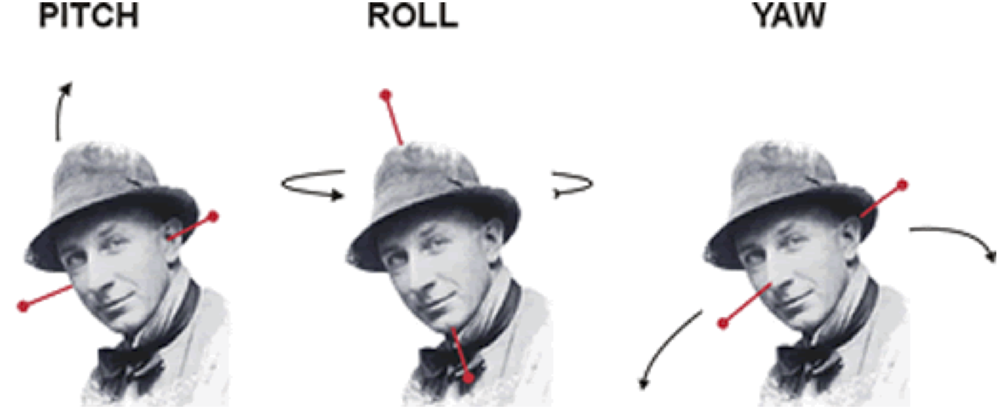
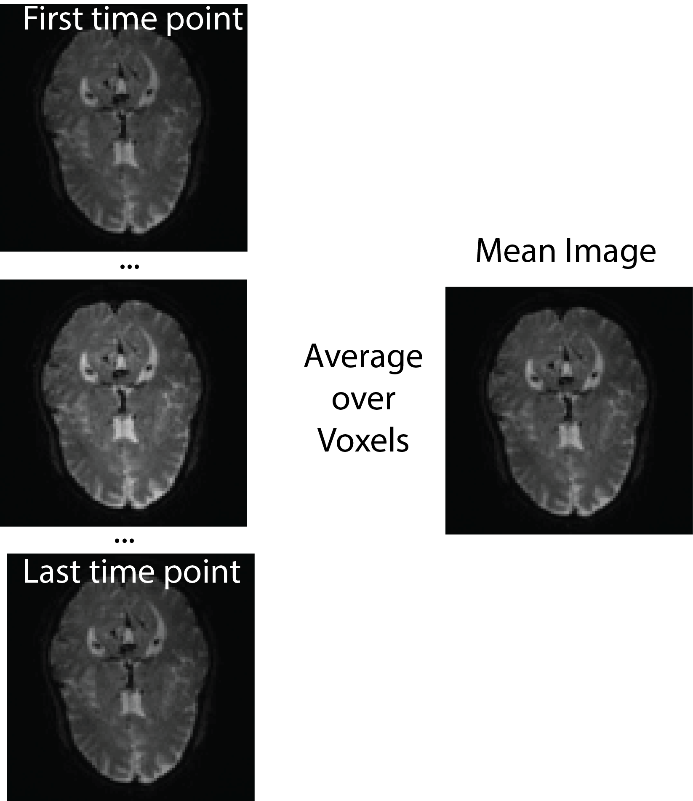
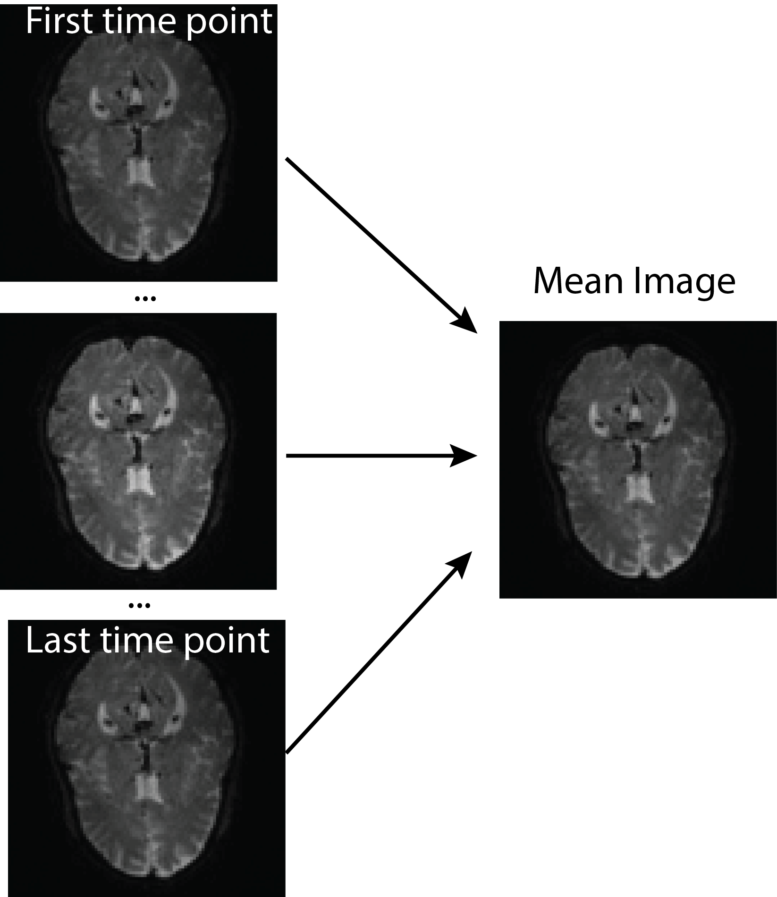
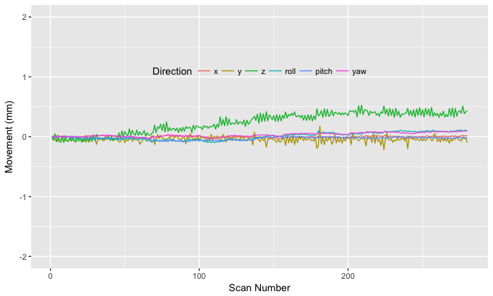
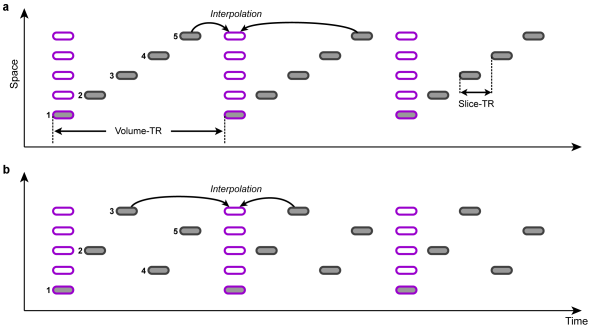

# Neuroconductor Example: fMRI Task Processing
John Muschelli<br/>http://johnmuschelli.com/talks/fmri_task_processing/<br/> Johns Hopkins Bloomberg School of Public Health  
<style type="text/css">
article {
  font-size: 30pt;
}
</style>


# Worked Example<br>Disclaimer: there is no universal fMRI pipeline

# `spm12r` Worked Example<br>Disclaimer: there is no universal fMRI pipeline

## Data required for analysis

- One anatomical T1-weighted scan: `anat.nii.gz`
- One 4D fMRI task-related scan: `fmri.nii.gz`.  
- Information on design:
    - onsets/duration of stimuli
- Order of slices (which was first slice) 
    - or time slice measured (in ms).
- Repetition time (TR) from DICOM header/scanner/tech.

## Worked example: DICOM conversion

- DICOM to NIfTI: Convert the data using `dcm2niix` (https://github.com/rordenlab/dcm2niix).
- `dcm2niir`: https://github.com/muschellij2/dcm2niir
- `divest`: https://github.com/jonclayden/divest


# Explore the Raw Data: <br><br>http://bit.ly/neuroshiny

## Download the data 

https://figshare.com/articles/SFO-example/5442298


```r
url = paste0("https://ndownloader.figshare.com/articles/",
             "5442298/versions/1")
# download a temporary zip file
zipfile = tempfile(fileext = ".zip")
res = httr::GET(url, write_disk(path = zipfile))

####### unzip file code (not shown) ###########

out_files = c("anat.nii.gz", "fmri.nii.gz")
```


## fMRI information


```r
fmri_filename = "fmri.nii.gz"
tr = 1.8 # seconds
# getting nifti header
hdr = neurobase::check_nifti_header(fmri_filename)

(nslices = oro.nifti::nsli(hdr))
```

```
[1] 60
```

```r
(n_time_points = oro.nifti::ntim(hdr))
```

```
[1] 280
```

```r
time_points = seq(n_time_points)
hdr
```

```
NIfTI-1 format
  Type            : nifti
  Data Type       : 16 (FLOAT32)
  Bits per Pixel  : 32
  Slice Code      : 0 (Unknown)
  Intent Code     : 0 (None)
  Qform Code      : 1 (Scanner_Anat)
  Sform Code      : 2 (Aligned_Anat)
  Dimension       : 96 x 96 x 60 x 280
  Pixel Dimension : 2.25 x 2.25 x 2.55 x 1.8
  Voxel Units     : mm
  Time Units      : sec
```

## Types of Registration
<div style="font-size: 20pt;">

- Rigid-body registration (linear) - 6 degrees of freedom (dof)


<div style="font-size: 8pt">
Image taken from [http://cnl.web.arizona.edu/imageprops.htm](http://cnl.web.arizona.edu/imageprops.htm)
</div>

- Pitch - Think of nodding ("yes")
- Yaw - Think of shaking head ("no") 
- Roll - Think of shoulder shrugging ("I don't know")
- x – left/right, y – forward/backward, z – jump up/down 

</div>

## Rigid Registration: The Math

<div style="font-size: 20pt;">

For a voxel $v$, the rigid transformation can be written as:

$$T_{\rm rigid}(v) = Rv + t$$
where $R =$
\small
$$\left[\begin{array}{ccc} \cos\beta\cos\gamma& \cos\alpha\sin\gamma + \sin\alpha\sin\beta\cos\gamma & \sin\alpha\sin\gamma - \cos\alpha\sin\beta\cos\gamma \\
-\cos\beta\sin\gamma & \cos\alpha\cos\gamma - \sin\alpha\sin\beta\sin\gamma & \sin\alpha\cos\gamma + \cos\alpha\sin\beta\sin\gamma \\
\sin\beta & -\sin\alpha\cos\beta & \cos\alpha\cos\beta \end{array}\right]$$
\normalsize

- 6 degrees of freedom
- $3$ associated with the translation vector: $t=(t_x, t_y, t_z)$
- $3$ associated with the rotation parameters: $\theta=(\alpha, \beta,\gamma)$. 

</div>


## Image Realignment: within-fMRI registration

<center>
 
</center>

## Image Realignment 


```r
realigned = spm12_realign(filename = fmri_filename,
  time_points = time_points,
  quality = 0.98, separation = 3,
  register_to = "mean",
  est_interp = "bspline4", reslice_interp = "bspline4")
# reading in the mean image
mean_img = realigned[["mean"]]
mean_nifti = readnii(mean_img)
rpfile = realigned[['rp']]
rp = read.table(file = rpfile, header = FALSE)
realigned$outfiles
realigned$mat
```


## Image Realignment 

<center>
 
</center>

### Plotting the realignment parameters

These can be used as regressors in motion correction for further analyses.


```r
colnames(rp) = c("x", "y", "z", "roll", "pitch", "yaw")
head(rp, 2)
```

<!-- -->

## Slice timing correction - temporal alignment

<center>
 
</center>

<div style="font-size: 20pt;">
From http://www.brainvoyager.com/bvqx/doc/UsersGuide/Preprocessing/SliceScanTimeCorrection.html
</div>

## Slice timing correction - temporal alignment


- Repetition time (from `hdr`)
- Number of time points and slices (from `hdr`)
- Need the reference slice (`ref_slice`), 
- slice order: ascending, contiguous (different for descending or interleaved)
- Time between the first and the last slice within one scan (`ta`).  `ta = 0` if you give slice order in seconds/milliseconds.

## Slice timing correction - temporal alignment


```r
slice_order = c(
  1740, 1680, 1620, 1560, 1500, 1440, 1380, 
  1320, 1260, 1200, 1140, 1080, 1020, 960, 
  900, 840, 780, 720, 660, 600, 540, 480, 
  420, 360, 300, 240, 180, 120, 60, 0, 
  1740, 1680, 1620, 1560, 1500, 1440, 1380, 
  1320, 1260, 1200, 1140, 1080, 1020, 960, 
  900, 840, 780, 720, 660, 600, 540, 480, 420, 
  360, 300, 240, 180, 120, 60, 0)
ref_slice = 900
ta = 0 # since slice_order in ms
```


## Slice timing correction - temporal alignment


```r
aimg = spm12_slice_timing(filename = realigned$outfiles,
  nslices = nslices,  tr = tr, slice_order = slice_order,
  time_points = seq(n_time_points),
  ta = ta, # since slice order given in ms 
  ref_slice = ref_slice, prefix = "a")
print(aimg$outfile)
```


## Spatial Normalization: T1 Coregistration to Mean fMRI

We then perform the coregistration using `spm12_coregister_estimate`, where the fixed image is the mean image and the moving image is the anatomical.


```r
t1_fname = "anat.nii.gz"
coreg = spm12_coregister_estimate(
  fixed = mean_img,
  moving = t1_fname, 
  cost_fun = "nmi")
coreg$outfile
```


## Spatial Normalization: T1 Coregistration to Mean fMRI

Nothing happened!

- `spm12_coregister_estimate` - estimates coregistration (transforms the header)
- `spm12_coregister_reslice` - reslices the image to the same voxel dimensions (should probably be coregistered already using `estimate`)
- `spm12_coregister` - estimates and reslices all in one.

- Estimate the transformation, but do segmentation on native T1 space (better resolution)


## Anatomical MRI Segmentation (and Spatial Normalize Estimation)

Here we perform the segmentation of the co-registered anatomical image from above.  This will segment the image into 6 different regions, where the regions are gray matter, white matter, cerebrospinal fluid (CSF), bone, soft tissue, and the background.  


```r
seg = spm12_segment(
  filename = coreg$outfile,
  set_origin = FALSE, 
  bias_corrected = TRUE, native = TRUE,
  unmodulated = TRUE, modulated = TRUE, affine = "mni",
  sampling_distance = 1.5)
```


## Anatomical MRI Segmentation (and Spatial Normalize Estimation)

- `native` - native space segmentations
- `modulated` - adjusted segmentations to constrain tissue-class volumes
- `unmodulated` - unadjusted 
- `bias_corrected` - save bias-field corrected image
- `set_origin` - should AC/PC alignment be done (no because we just coregistered)

## Applying Spatial Normalization Transformation

Now that we have esimated the transformation from the T1 image, we can take that deformation and apply it to the fMRI data using `spm12_normalize_write`.  Again, we are registering to the MNI template and will use a standard bounding box.  We pass the anatomical, mean fMRI, and 4D fMRI data in to be transformed.  


```r
bounding_box = matrix(
    c(-78, -112, -70, 
      78, 76, 85), nrow = 2, 
    byrow = TRUE)
norm = spm12_normalize_write(
  deformation = seg$deformation,
  other.files = aimg$outfile,
  bounding_box = bounding_box,
  interp = "bspline5",
  retimg = FALSE)
```

## Applying Spatial Normalization Transformation


```r
anat_norm = spm12_normalize_write(
  deformation = seg$deformation,
  other.files = seg$bias_corrected,
  bounding_box = bounding_box,
  interp = "bspline5",
  voxel_size = c(1, 1, 1),
  retimg = FALSE
)
```

## Applying Spatial Normalization Transformation


```r
anat_norm2x2x2 = spm12_normalize_write(
  deformation = seg$deformation,
  other.files = seg$bias_corrected,
  bounding_box = bounding_box,
  interp = "bspline5",
  voxel_size = c(2, 2, 2), # note the resolution!!!
  retimg = FALSE
)  
```


## Spatial smoothing using a Gaussian

Smoothing is specifieid using the full-width half max (FWHM) for the Gaussian smoother.  Relationship between the FWHM and the Gaussian $\sigma$:

$$
FWHM = \sigma \sqrt{8 \log(2)}
$$
where $\log$ is the natural log.  


## Spatial smoothing using a Gaussian


```r
smooth_norm = spm12_smooth(
  norm$outfiles[[1]], 
  fwhm = 5, 
  prefix = "s5",
  retimg = FALSE)
```

In many applications, this is the data you will use for post-processing and analysis.  Motion correction has usually been applied above, but some motion correct this data as well. 

# First Level Modeling<br>Single-Subject Model

## Estimate Model 


## Contrast Manager - Creating Contrasts


